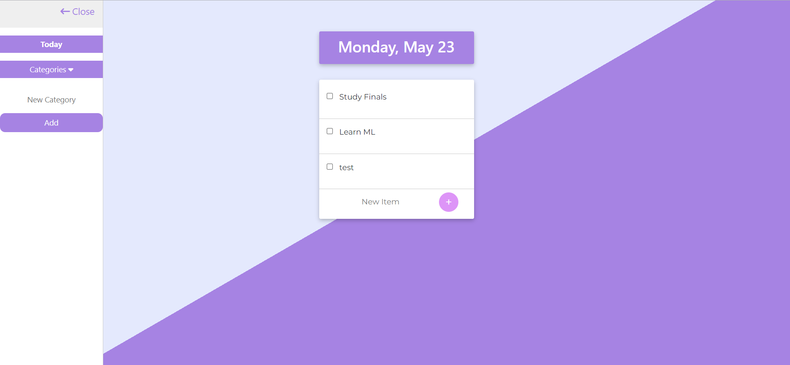
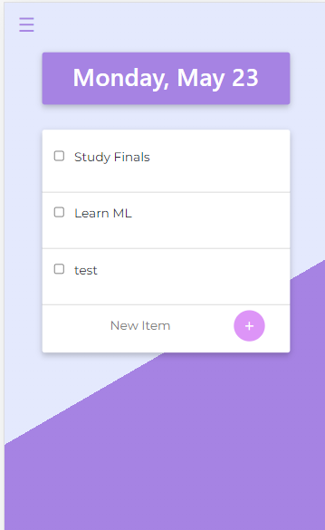

# Todo App with MongoDB 

This is a todo app that you can keep your works with an easy UI.

## Table of contents

- [Overview](#overview)
    - [The challenge](#the-challenge)
    - [Screenshot](#screenshot)
    - [Links](#links)
- [My process](#my-process)
    - [Built with](#built-with)
    - [What I learned](#what-i-learned)
    - [Continued development](#continued-development)
    - [Useful resources](#useful-resources)
- [Author](#author)
- [Acknowledgments](#acknowledgments)

## Overview

### The challenge

Users should be able to:

- Keep your works daily or categorised
- Create any category 
- Delete any work from list by clicking box next to it
- With MongoDb you can keep your work without loosing it when you refresh or visit the site after closing.

## Screenshot

###Desktop View



### Mobile View


### Links
- Solution URL: [Github Repo](https://github.com/bbaltuntas/Todo-Web-App---MongoDB)
- Live Site URL: [Live Site - Heroku](https://intense-fortress-24701.herokuapp.com/)

## My process

### Built with

- Semantic HTML5 markup
- CSS custom properties
- Flexbox
- Mobile-first workflow
- [node.js](http://nodejs.org) - for the backend
- [MongoDB](https://www.mongodb.com/) - for Database
- [Express](https://expressjs.com) - node.js network framework
- [EJS](https://ejs.co) - node.js template framework
- [jQuery](https://jquery.com/) - For DOM
- [Bootstrap](https://getbootstrap.com/) - The most popular HTML, CSS, and JavaScript framework
- [W3School CSS](https://www.w3schools.com/w3css/defaulT.asp) - CSS framework
- [Google Fonts](https://fonts.google.com) - Beautiful Fonts
- [Font Awesome](https://fontawesome.com/) - Icons


```html
<h1>Some HTML code I'm proud of</h1>
```

```css
.proud-of-this-css {
    color: papayawhip;
}
```

```js
const proudOfThisFunc = () => {
    console.log('🎉')
}
```
#Installation
To run the web app on your local computer you need Node.js to run.
```
cd todolist-v1
npm i
node app.js
```
## Author

- Github - [Bora Barış Altuntaş](https://github.com/bbaltuntas)
